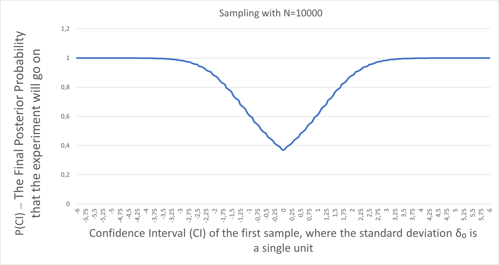

# CNOT decomposition with clean ancilla primitive and with no chain of CNOTs

Take a look at the calculations for the hypergeometric distribution with a deck of cards, black (successes) and red. 

We analyze the case where the following is done with the N-card deck ($\frac{N}{2}$ of them black): 

1. Half of the deck is drawn; black cards are counted
2. The agent decides whether half of the rest of the cards should be drawn or not
3. Half of the rest of the cards are either drawn or not; black cards are counted

Here comes the interesting part: It may seem that, if certain conditions are met, then,  after step 1 is done, one can literally predict if experiment will continue (the agent's decision), based only on the number of black cards in the first draw, using the Bayesian theorem. In fact, the greater the deviation of the first sample is, the bigger the probability of the experiment's continuation:

With the prior probability of continuation being set to 0.5, we get:

$P(Continued|k_0=x) = \frac{P(k_0=x|Continued)*0,5}{P(k_0=x)}$

There is also a more complicated formula:

$=\frac{\sum_{k_{1i}=0}^{\frac{1}{4}N}\sum_{k_{0j}=0}^{\frac{1}{2}N} (min[(1-(\sum_{y=0}^{k_{1i}+k_{0j}-1}\frac{3}{4}(\frac{0.5N}{y-1})(\frac{0.5N}{\frac{3}{4}N-y+1})));(\sum_{y=0}^{k_{1i}+k_{0j}}\frac{3}{4}(\frac{0.5N}{y})(\frac{0.5N}{\frac{3}{4}N-y}))])}{(\frac{0.5N}{x})(\frac{0.5N}{0.5N-x})}$

The point is, the probability of continuation is not always $\frac{1}{2}$, it varies based on the deck size N and the number of black cards in the first draw, that is x. But we don't need to know these two variables exactly: 
Let 'z' denote the Confidence Interval (CI) of the first sample, where the standard deviation $\delta_0$ is a single unit: $z=\sqrt{\frac{(x-0.25*N)(\sqrt{N-1})}{N}}$. Then, $P(Continued|k_0=x)$ is approximately a function of 'z' (due to the Central Limit Theorem).

Assume $N=10000$. If we enter the above 'complicated' formula into Microsoft Excel, we get: 

Now, let's just work with $N=4$.

The probabilities from left to right are $41\frac{2}{3}$%, $25$%, $8\frac{1}{3}$%, $25$%. If the qubit ancilla[0] is 0, then the probability of ancilla[2] being 1 is (25% / (41⅔% + 25%)) × 100% = 37.5%. And if the qubit ancilla[0] is 1, then the probability of ancilla[2] being 1 is 75%. 

Code and pictures of the corresponding quantum circuits are licensed under GPLv3.
