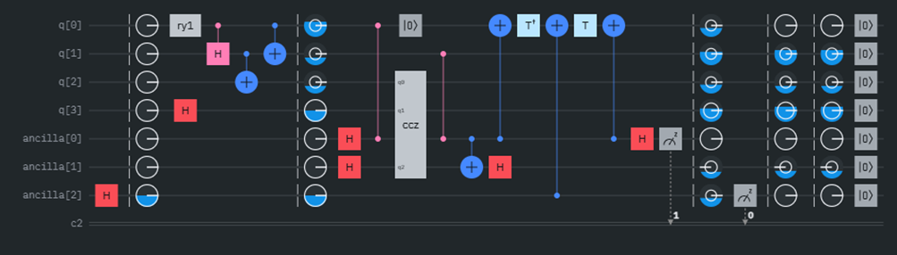
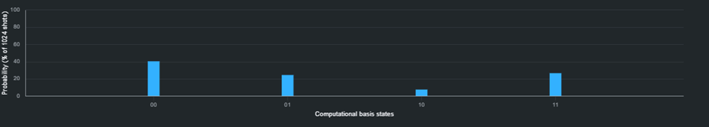
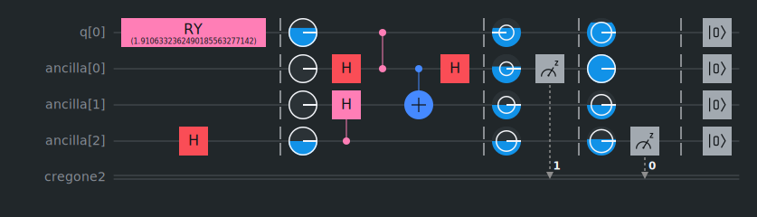
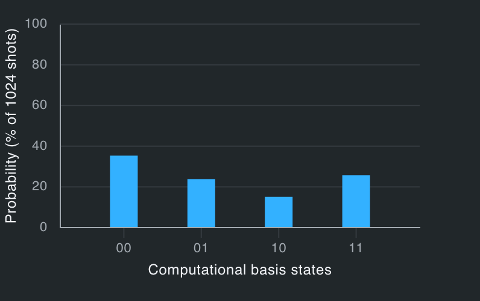
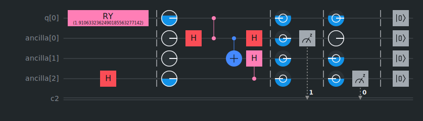
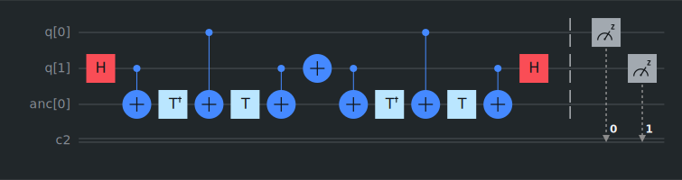

# CNOT decomposition with clean ancilla primitive and with no chain of CNOTs

Take a look at the calculations for the hypergeometric distribution with a deck of cards, black (successes) and red. 

We analyze the case where the following is done with the N-card deck ($\frac{N}{2}$ of them black): 

1. Half of the deck is drawn; black cards are counted
2. The agent decides whether half of the rest of the cards should be drawn or not
3. Half of the rest of the cards are either drawn or not; black cards are counted

Here comes the interesting part: It may seem that, if certain conditions are met, then,  after step 1 is done, one can literally predict if experiment will continue (the agent's decision), based only on the number of black cards in the first draw, using the Bayesian theorem. In fact, the greater the deviation of the first sample is, the bigger the probability of the experiment's continuation:

With the prior probability of continuation being set to 0.5, we get:

$P(Continued|k_0=x) = \frac{P(k_0=x|Continued)*0,5}{P(k_0=x)}$

There is also a more complicated formula:

$=\frac{\sum_{k_{1i}=0}^{\frac{1}{4}N}\sum_{k_{0j}=0}^{\frac{1}{2}N} (min[(1-(\sum_{y=0}^{k_{1i}+k_{0j}-1}\frac{3}{4}(\frac{0.5N}{y-1})(\frac{0.5N}{\frac{3}{4}N-y+1})));(\sum_{y=0}^{k_{1i}+k_{0j}}\frac{3}{4}(\frac{0.5N}{y})(\frac{0.5N}{\frac{3}{4}N-y}))])}{(\frac{0.5N}{x})(\frac{0.5N}{0.5N-x})}$

The point is, the probability of continuation is not always $\frac{1}{2}$, it varies based on the deck size N and the number of black cards in the first draw, that is x. But we don't need to know these two variables exactly: 
Let 'z' denote the Confidence Interval (CI) of the first sample, where the standard deviation $\delta_0$ is a single unit: $z=\sqrt{\frac{(x-0.25*N)(\sqrt{N-1})}{N}}$. Then, $P(Continued|k_0=x)$ is approximately a function of 'z' (due to the Central Limit Theorem).

Assume $N=10000$. If we enter the above 'complicated' formula into Microsoft Excel, we get: 

Now, let's just work with $N=4$.
If we get 1 black card, which is exactly in the middle of the graph, then the probability would be as small as 37,5%. And if we get 0 or 2 black cards in the first draw, then the probability of continuation is 75%. 

We can now simulate this with a quantum circuit. In fact, there is no need to distinguish between 0 and 2 black cards, because they are linked to the same probability value. 

The probabilities from left to right are $41\frac{2}{3}$%, $25$%, $8\frac{1}{3}$%, $25$%. If the qubit ancilla[0] is 0, then the probability of ancilla[2] being 1 is (25% / (41⅔% + 25%)) × 100% = 37.5%. And if the qubit ancilla[0] is 1, then the probability of ancilla[2] being 1 is 75%. 

We can now simplify the quantum circuit above (the Hadamard on ancilla[2] represents the agent's decision, and the controlled Hadamard stays for the conditional continuation of the experiment, whose rules are outlined above): 

Just for reference, this simplification alters the probabilities above, a bit:

It's easy to see that, there is no signaling in any of the two circuits, as we run into the following no-go: the idea tries to achieve the same result with this circuit: 

This doesn't work because this is no different from a classic deck of cards: up to the point where the agent finally decides, the whole deck is already drawn. 

If we still want the numbers to work, we take the former case, which works well as a quantum circuit. The first point of this study is, the probabilities that the hypergeometric model delivers are not to be taken for granted: while being only a correlation, the function from the graph above only works for the quantum version of the experiment setting, rather than the classical one. Based on this, we can work out certain condition to be met by the quantum deck of cards: the agent's lack of knowledge about the quantum system must be ontological, not epistemic (quantum indeterminacy). In the classic deck of cards, this criterion is simply assumed, so the correlation does not even arise.

Additionally (the second point being made here), the shared structure of the first circuit and its simplified version has an interesting feature that we will soon take a closer look at. For now, let's look for the corresponding CNOT decomposition that makes the full use of it:

What's special about the decomposition (here comes the feature), it does not make use of a sequence of the two following equalities to provide the complete CNOT-matrix (apart from global phase): 

 

[Source: IBM Quantum Platform](https://quantum.cloud.ibm.com/learning/images/courses/foundations-of-quantum-error-correction/fault-tolerant-quantum-computing/CNOT-error-propagation.svg)

Additionally, it achieves the clean ancilla primitive through interference. So, the ancilla qubit's state thereafter is the same as before the CNOT.

Code and pictures of the corresponding quantum circuits are licensed under GPLv3.
